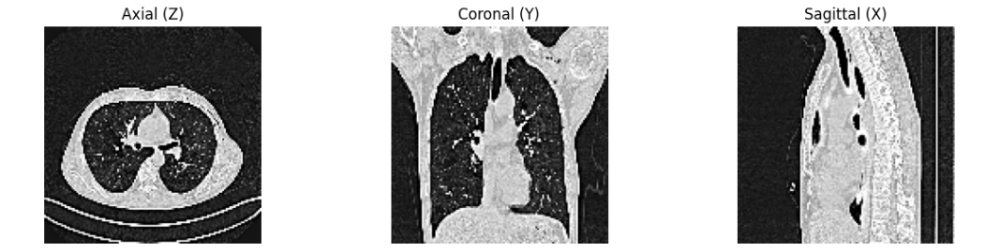

# PHAROS-AIF-MIH

## Abstract
We propose an approach for COVID-19 detection and severity assessment from chest CT scans. Our method leverages both 2.5D and 3D representations to capture both local and global patterns in the data. The 2.5D approach uses multiview slices of a CT scan and uses a DINOv3 backbone for feature extraction and downstream training. The 3D approach uses the 3D ResNet-18 model to learn feature representations using a Variance Risk Extrapolation pretraining and contrastive supervised finetuning. Benchmarking on datasets focused on multi-source robustness and gender bias, we present an ensemble of both approaches - reaching a MacroF1 score of [insert value here].

## Dataset file structure

Unzip the competition datasets and place them in this structure below:

```
- data
    - task_1
        - 1st_challenge_test_set
            - test
        - covid1
        - covid2
        - non-covid1
        - non-covid2
        - non-covid3
        - Validation
            - val
                - covid
                - non-covid
        - train_covid.csv
        - train_non_covid.csv
        - validation_non_covid.csv
        - validation_non_covid.csv
    - task_2
        - 2nd_challenge_test_set
            - test_for_participants
        - train1
            - A
            - G
        - train2
            - covid
            - normal
        - Validation
            - val
                - A
                - G
                - covid
                - normal
```

## Preprocessing

`task1_preprocess.py` and `task2_preprocess.py` reads the task datasets and processes them by reconstructing a 3D CT scan from Axial view slices as such:
- Read scans, remove duplicates
- Concatinate the slices on top on of each other
- Resize into `128 x 128 x 128` volumes
- 3D Gaussian denoising and mask sharpen
- Normalize into [0, 255] grayscale values

The resulting volume provides the Coronal and Sagittal views that weren't previously available.



`make_task1_csv.py` and `make_task2_csv.py` generates CSVs for indexing the volumes and labels for fast implementation.

## 3D ResNet-18 (R3D-18) Approach

### Architecture
We implemented a 3D ResNet-18 model adapted for single-channel CT scan input:
- **Backbone**: Pretrained R3D-18 with modified first convolution layer (3→1 channels)
- **Input**: 128×128×128 volumetric CT scans
- **Output**: Multi-class classification head

### Training Strategy

#### Two-Stage Training Pipeline

**Stage 1: Domain Pretraining with VRE**
- **Objective**: Variance Risk Extrapolation (VRE) for domain generalization
- **Loss**: Cross-Entropy + λ×variance(per-domain losses)
- **Targets**: Source domain labels (gender for Task 2, data source for Task 1)
- **Duration**: 5 epochs
- **Learning Rate**: 1e-4 with Cosine Annealing

**Stage 2: Task-Specific Fine-tuning**
- **Objective**: Supervised classification with contrastive learning
- **Augmentation**: MixUp (α=0.4) for improved generalization
- **Loss**: Cross-Entropy + Supervised Contrastive Loss
- **Duration**: 20 epochs
- **Learning Rate**: 1e-5 with Cosine Annealing

#### Key Techniques
- **MixUp Data Augmentation**: Blends samples and labels for robustness
- **Supervised Contrastive Learning**: Enhances feature separation
- **Gradient Accumulation**: Enables effective training with limited memory
- **AMP (Automatic Mixed Precision)**: Accelerates training

### Results

#### Task 1: COVID-19 Detection (Binary Classification)
- **Validation Accuracy**: 87.01%
- **Macro F1-Score**: 0.7648
- **Per-Source Performance**:
  - Source 0: F1=0.8630
  - Source 1: F1=0.8408
  - Source 2: F1=0.4828
  - Source 3: F1=0.8725

#### Task 2: Multi-Class Classification (A, G, COVID, Normal)
- **Validation Accuracy**: 76.77%
- **Macro F1-Score**: 0.66.77
- **Per-Gender Performance**:
  - Male: F1=0.7249
  - Female: F1=0.6104

#### Class-wise Performance (Task 2)
- **Class A**: Precision=0.6901, Recall=0.9800, F1=0.8099
- **Class G**: Precision=0.7500, Recall=0.1200, F1=0.2069
- **COVID**: Precision=0.8462, Recall=0.8250, F1=0.8354
- **Normal**: Precision=0.8293, Recall=0.8500, F1=0.8395

### Analysis
- The VRE pretraining significantly improved cross-domain generalization
- MixUp augmentation enhanced robustness to domain shifts
- Strong performance on COVID detection but challenges with Class G (Ground Glass) classification
- Gender bias observed in Task 2, with better performance on male scans

### Technical Implementation
- **Framework**: PyTorch with torchvision.models.video.r3d_18
- **Hardware**: GPU training with CUDA AMP acceleration
- **Batch Size**: 32 samples per batch
- **Optimization**: AdamW optimizer with weight decay 1e-5

